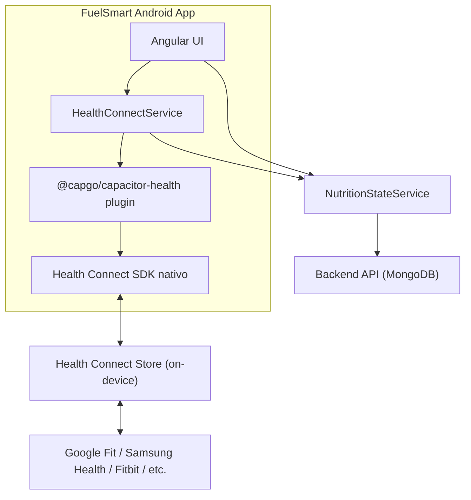

# 🏥 Plan: Integración de Health Connect en FuelSmart

## Resumen Ejecutivo

Integrar **Android Health Connect** en FuelSmart para leer/escribir datos de salud del dispositivo, enriqueciendo la app con pasos, peso, ejercicio, calorías quemadas y nutrición — todo desde una sola fuente unificada.

> [!IMPORTANT]
> Health Connect es **on-device only** (no tiene REST API). Al ser FuelSmart una app Capacitor/Android, podemos usar el plugin nativo directamente — **no necesitamos ningún "bridge" externo**.

---

## Arquitectura Propuesta



> Health Connect actúa como **hub central** en el dispositivo. Cualquier wearable o app de fitness que el usuario tenga (Google Fit, Samsung Health, Fitbit, Garmin, etc.) sincroniza automáticamente sus datos ahí.

---

## Datos que podemos leer y escribir

| Dato | Record Class | Lectura | Escritura | Uso en FuelSmart |
|:---|:---|:---:|:---:|:---|
| **Pasos** | `StepsRecord` | ✅ | — | Mostrar actividad diaria en dashboard |
| **Calorías quemadas** | `TotalCaloriesBurnedRecord` | ✅ | — | Calcular TDEE real vs estimado |
| **Ejercicio** | `ExerciseSessionRecord` | ✅ | — | Mostrar entrenamientos del día |
| **Peso** | `WeightRecord` | ✅ | ✅ | Sincronizar peso actual con perfil |
| **Nutrición** | `NutritionRecord` | ✅ | ✅ | Exportar comidas registradas a HC |
| **Hidratación** | `HydrationRecord` | ✅ | ✅ | Sincronizar vasos de agua |
| **BMR** | `BasalMetabolicRateRecord` | ✅ | — | Comparar BMR real vs Mifflin-St Jeor |

---

## Fases de Implementación

### Fase 1 — Setup del Plugin (~1-2 horas)

#### 1.1 Instalar `@capgo/capacitor-health`

```bash
npm install @capgo/capacitor-health
npx cap sync android
```

#### 1.2 Configurar `AndroidManifest.xml`

Agregar los permisos de Health Connect en [android/app/src/main/AndroidManifest.xml](file:///home/lisandro/proyectos/propios/calorias/android/app/src/main/AndroidManifest.xml):

```xml
<!-- Health Connect Permissions -->
<uses-permission android:name="android.permission.health.READ_STEPS" />
<uses-permission android:name="android.permission.health.READ_TOTAL_CALORIES_BURNED" />
<uses-permission android:name="android.permission.health.READ_EXERCISE" />
<uses-permission android:name="android.permission.health.READ_WEIGHT" />
<uses-permission android:name="android.permission.health.WRITE_WEIGHT" />
<uses-permission android:name="android.permission.health.READ_NUTRITION" />
<uses-permission android:name="android.permission.health.WRITE_NUTRITION" />
<uses-permission android:name="android.permission.health.READ_HYDRATION" />
<uses-permission android:name="android.permission.health.WRITE_HYDRATION" />
<uses-permission android:name="android.permission.health.READ_BASAL_METABOLIC_RATE" />

<!-- Activity filter para Health Connect privacy policy -->
<activity android:name=".HealthConnectPermissionsActivity"
    android:exported="true">
    <intent-filter>
        <action android:name="androidx.health.ACTION_SHOW_PERMISSIONS_RATIONALE" />
    </intent-filter>
</activity>
```

#### 1.3 Política de Privacidad

Health Connect **requiere** una política de privacidad accesible. Opciones:

1. Agregar URL en `android/app/src/main/res/values/strings.xml`:
   ```xml
   <string name="health_connect_privacy_policy_url">https://fuelsmart.app/privacy</string>
   ```
2. O colocar un HTML local en `www/privacypolicy.html`

#### 1.4 Verificar `variables.gradle`

El SDK actual (`minSdkVersion = 24`) cumple el mínimo de HC (SDK 26+ recomendado). Considerar subir a 26:

```diff
-    minSdkVersion = 24
+    minSdkVersion = 26
```

> [!NOTE]
> Health Connect viene preinstalado en Android 14+. En Android 8-13, el usuario debe instalar la app "Health Connect" desde Play Store.

---

### Fase 2 — Servicio Angular `HealthConnectService` (~3-4 horas)

Crear `src/app/services/health-connect.service.ts`:

```typescript
import { Injectable, signal, inject, computed } from '@angular/core';
import { Platform } from '@ionic/angular';
import { Health } from '@capgo/capacitor-health';
import { NutritionStateService } from './nutrition-state.service';

export interface HealthDaySummary {
  steps: number;
  caloriesBurned: number;
  exercises: { name: string; duration: number; calories: number }[];
  weight: number | null;
  bmr: number | null;
}

@Injectable({ providedIn: 'root' })
export class HealthConnectService {
  private platform = inject(Platform);
  private nutritionState = inject(NutritionStateService);

  // ─── State ───
  isAvailable = signal(false);
  isAuthorized = signal(false);
  todaySummary = signal<HealthDaySummary>({
    steps: 0,
    caloriesBurned: 0,
    exercises: [],
    weight: null,
    bmr: null,
  });

  // ─── Computed ───
  realTDEE = computed(() => {
    const burned = this.todaySummary().caloriesBurned;
    return burned > 0 ? burned : null;
  });

  stepsGoalProgress = computed(() => {
    const STEPS_GOAL = 10_000;
    return Math.min(this.todaySummary().steps / STEPS_GOAL, 1);
  });

  constructor() {
    this.checkAvailability();
  }

  async checkAvailability(): Promise<boolean> {
    if (!this.platform.is('android')) {
      this.isAvailable.set(false);
      return false;
    }
    try {
      const result = await Health.isAvailable();
      this.isAvailable.set(result.available);
      return result.available;
    } catch {
      this.isAvailable.set(false);
      return false;
    }
  }

  async requestPermissions(): Promise<boolean> {
    try {
      await Health.requestAuthorization({
        read: [
          'steps',
          'calories.burned',
          'exercise',
          'weight',
          'nutrition',
          'water',
          'basal_metabolic_rate',
        ],
        write: ['weight', 'nutrition', 'water'],
      });
      this.isAuthorized.set(true);
      return true;
    } catch (err) {
      console.error('Health Connect permission denied:', err);
      this.isAuthorized.set(false);
      return false;
    }
  }

  async readTodayData(): Promise<void> {
    const startOfDay = new Date();
    startOfDay.setHours(0, 0, 0, 0);
    const now = new Date();

    const [steps, calories, weight] = await Promise.all([
      this.readSteps(startOfDay, now),
      this.readCaloriesBurned(startOfDay, now),
      this.readLatestWeight(),
    ]);

    this.todaySummary.update(s => ({
      ...s,
      steps,
      caloriesBurned: calories,
      weight,
    }));
  }

  private async readSteps(start: Date, end: Date): Promise<number> {
    try {
      const result = await Health.readSamples({
        dataType: 'steps',
        startDate: start.toISOString(),
        endDate: end.toISOString(),
        limit: 1000,
      });
      return result.samples?.reduce((sum, s) => sum + (s.value || 0), 0) ?? 0;
    } catch {
      return 0;
    }
  }

  private async readCaloriesBurned(start: Date, end: Date): Promise<number> {
    try {
      const result = await Health.readSamples({
        dataType: 'calories.burned',
        startDate: start.toISOString(),
        endDate: end.toISOString(),
        limit: 100,
      });
      return Math.round(
        result.samples?.reduce((sum, s) => sum + (s.value || 0), 0) ?? 0
      );
    } catch {
      return 0;
    }
  }

  private async readLatestWeight(): Promise<number | null> {
    try {
      const thirtyDaysAgo = new Date();
      thirtyDaysAgo.setDate(thirtyDaysAgo.getDate() - 30);
      const result = await Health.readSamples({
        dataType: 'weight',
        startDate: thirtyDaysAgo.toISOString(),
        endDate: new Date().toISOString(),
        limit: 1,
      });
      if (result.samples && result.samples.length > 0) {
        return result.samples[result.samples.length - 1].value ?? null;
      }
      return null;
    } catch {
      return null;
    }
  }

  // ─── Write methods ───

  async writeWeight(weightKg: number): Promise<void> {
    await Health.saveSample({
      dataType: 'weight',
      value: weightKg,
      startDate: new Date().toISOString(),
      endDate: new Date().toISOString(),
    });
  }

  async writeNutrition(meals: any[]): Promise<void> {
    // Escribir las comidas del día como NutritionRecord
    for (const meal of meals) {
      for (const food of meal.foods) {
        await Health.saveSample({
          dataType: 'nutrition',
          value: food.calories,
          startDate: new Date().toISOString(),
          endDate: new Date().toISOString(),
          metadata: {
            name: food.name,
            protein: food.protein,
            carbs: food.carbs,
            fat: food.fat,
          },
        });
      }
    }
  }

  async writeHydration(glasses: number): Promise<void> {
    const mlPerGlass = 250;
    await Health.saveSample({
      dataType: 'water',
      value: glasses * mlPerGlass,
      startDate: new Date().toISOString(),
      endDate: new Date().toISOString(),
    });
  }
}
```

> [!WARNING]
> Los nombres exactos de `dataType` (`'steps'`, `'calories.burned'`, `'weight'`, etc.) pueden variar según la versión del plugin. Verificar la documentación de `@capgo/capacitor-health` antes de implementar.

---

### Fase 3 — Integración con UI (~3-4 horas)

#### 3.1 Tarjeta de Actividad en el Dashboard

Agregar una tarjeta en [dashboard.component.ts](file:///home/lisandro/proyectos/propios/calorias/src/app/components/dashboard.component.ts) para mostrar:

- **Pasos del día** con barra de progreso circular
- **Calorías quemadas** (TDEE real del wearable)
- **Ejercicios** del día (si hay sesiones)

```
┌──────────────────────────┐
│  🏃 Actividad de Hoy     │
│                          │
│  ⬡ 7,432 pasos          │
│  [████████░░] 74%        │
│                          │
│  🔥 1,847 kcal quemadas  │
│  📊 TDEE estimado: 2,100 │
│                          │
│  🏋️ Running · 35 min     │
└──────────────────────────┘
```

#### 3.2 Sincronización de Peso Bidireccional

En [profile.component.ts](file:///home/lisandro/proyectos/propios/calorias/src/app/components/profile.component.ts):

- Al abrir perfil → leer último peso desde Health Connect
- Si el peso de HC es más reciente → preguntar al usuario si actualizar
- Al guardar peso manualmente → escribir a Health Connect

#### 3.3 Badge de Health Connect en Progress

En [progress.component.ts](file:///home/lisandro/proyectos/propios/calorias/src/app/components/progress.component.ts):

- Mostrar **TDEE real vs estimado** cuando hay datos de HC
- Agregar gráfica de pasos diarios junto a la de calorías

#### 3.4 Exportar comidas a Health Connect

Agregar opción en [meal-block.component.ts](file:///home/lisandro/proyectos/propios/calorias/src/app/components/meal-block.component.ts):

- Botón para exportar comida registrada como `NutritionRecord`
- Opción de auto-export al registrar comida

---

### Fase 4 — Permisos y Onboarding (~2 horas)

#### 4.1 Pantalla de permisos de Health Connect

Agregar un slide adicional al [onboarding.component.ts](file:///home/lisandro/proyectos/propios/calorias/src/app/components/onboarding.component.ts):

```
Slide 3: "Conecta tu Salud"
- Icono: fitness-outline
- Texto: "Conecta con Health Connect para ver tus pasos, 
  calorías quemadas y sincronizar tu peso automáticamente."
- Botón: "Conectar Health Connect"
- Link: "Ahora no" (skip)
```

#### 4.2 Toggle en Perfil

En el componente de perfil, agregar sección:

```
┌──────────────────────────┐
│  Health Connect          │
│  [Toggle] Conectado ✅    │
│                          │
│  Auto-sync peso     [✓]  │
│  Exportar comidas   [✓]  │
│  Exportar agua      [✓]  │
└──────────────────────────┘
```

---

### Fase 5 — TDEE Inteligente (~2 horas)

Mejorar el cálculo de TDEE en [nutrition-state.service.ts](file:///home/lisandro/proyectos/propios/calorias/src/app/services/nutrition-state.service.ts):

```typescript
// TDEE mejorado: usa datos reales de Health Connect si están disponibles
smartTDEE = computed(() => {
  const hcCalories = this.healthConnect.realTDEE();
  
  if (hcCalories && hcCalories > 500) {
    // Promedio ponderado: 70% datos reales, 30% fórmula
    return Math.round(hcCalories * 0.7 + this.tdee() * 0.3);
  }
  
  return this.tdee(); // Fallback a Mifflin-St Jeor
});
```

> [!TIP]
> El **TDEE real** del wearable es MUCHO más preciso que la estimación por fórmula. Esto mejora enormemente las predicciones de pérdida/ganancia de peso.

---

## Archivos a crear/modificar

| Acción | Archivo |
|:---|:---|
| 🆕 Crear | `src/app/services/health-connect.service.ts` |
| 🆕 Crear | `src/app/components/activity-card.component.ts` |
| ✏️ Modificar | `src/app/components/dashboard.component.ts` — agregar tarjeta de actividad |
| ✏️ Modificar | `src/app/components/profile.component.ts` — toggle HC + sync peso |
| ✏️ Modificar | `src/app/components/progress.component.ts` — TDEE real + pasos |
| ✏️ Modificar | `src/app/components/onboarding.component.ts` — slide de HC |
| ✏️ Modificar | `src/app/services/nutrition-state.service.ts` — smart TDEE |
| ✏️ Modificar | `android/app/src/main/AndroidManifest.xml` — permisos |
| ✏️ Modificar | `android/variables.gradle` — minSdkVersion a 26 |
| 🆕 Crear | `www/privacypolicy.html` — política de privacidad para HC |

---

## Consideraciones para Play Store

> [!CAUTION]
> Google requiere un **formulario de declaración** al publicar apps que usan Health Connect. Debes:
> 1. Declarar **exactamente** qué datos lees/escribes y por qué
> 2. Tener una **política de privacidad** accesible
> 3. Explicar que los datos **no se venden** a terceros
> 4. El review de Google para Health Connect puede tardar **hasta 2 semanas extra**

---

## Timeline Estimado

| Fase | Tiempo | Prioridad |
|:---|:---|:---|
| Fase 1 — Setup del Plugin | 1-2 hrs | 🔴 Alta |
| Fase 2 — HealthConnectService | 3-4 hrs | 🔴 Alta |
| Fase 3 — Integración UI | 3-4 hrs | 🟡 Media |
| Fase 4 — Permisos y Onboarding | 2 hrs | 🟡 Media |
| Fase 5 — TDEE Inteligente | 2 hrs | 🟢 Baja |
| **Total estimado** | **~12-14 hrs** | |

---

## Preguntas para definir antes de empezar

1. **¿Quieres empezar con lectura solamente** (pasos, peso, calorías quemadas) o también escritura (exportar comidas a HC)?
2. **¿Quieres que el peso de HC actualice automáticamente** el perfil de FuelSmart, o que pida confirmación?
3. **¿Ya tienes la política de privacidad** de FuelSmart en `fuelsmart.app/privacy`, o la creamos?
4. **¿Subir minSdkVersion a 26?** — Esto descarta Android 7 (menos del 3% de dispositivos activos en 2026).
