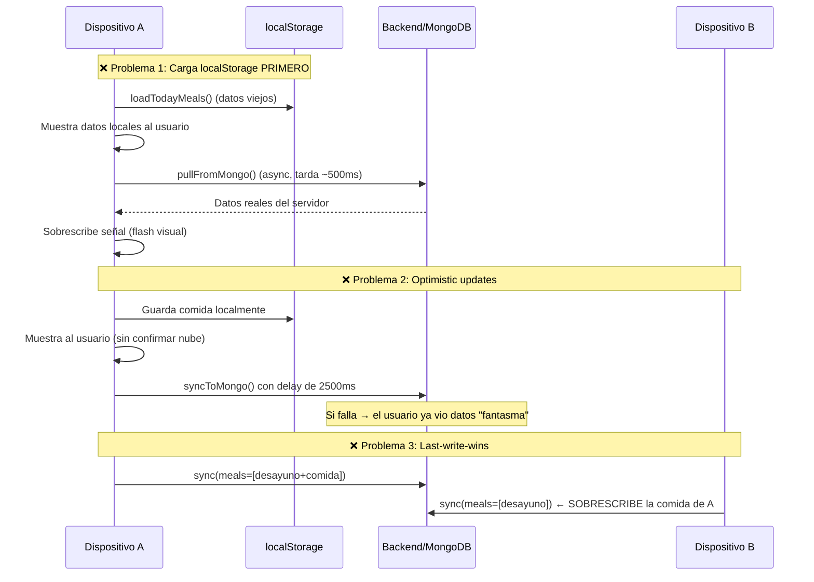
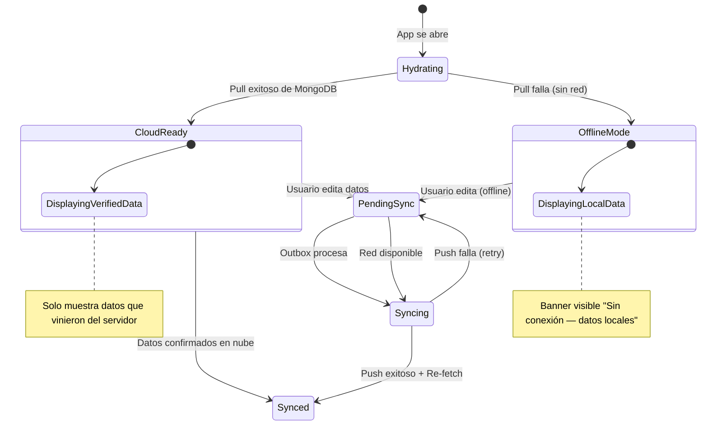
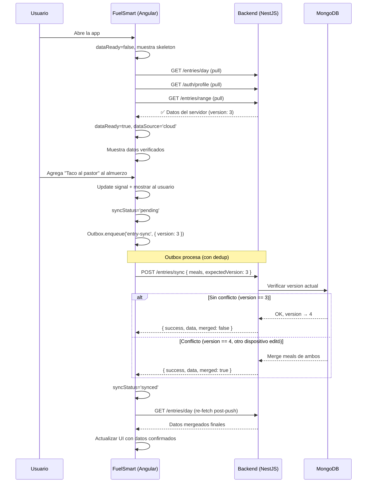

# 🔒 Plan: Consistencia de Datos Multi-Dispositivo

## El Problema

Cuando un usuario abre FuelSmart en dos dispositivos (ej. teléfono y tablet), el sistema actual puede mostrar **datos desactualizados o no respaldados en la nube**, causando desfases como:

- Dispositivo A agrega "almuerzo" → Dispositivo B no lo ve hasta que refresca
- Dispositivo B modifica "cena" mientras A tiene una versión distinta → se sobreescribe
- La app carga datos de `localStorage` primero y el usuario los ve antes del pull de MongoDB

---

## Diagnóstico: 7 Problemas en el Flujo Actual



### Lista completa de problemas

| # | Problema | Ubicación | Impacto |
|:--|:---|:---|:---|
| 1 | **localStorage como fuente inicial** | [loadTodayMeals()](file:///home/lisandro/proyectos/propios/calorias/src/app/services/nutrition-state.service.ts#L702-L713) | Muestra datos viejos de otro dispositivo |
| 2 | **Optimistic updates sin verificación** | [effect() en línea 251](file:///home/lisandro/proyectos/propios/calorias/src/app/services/nutrition-state.service.ts#L251-L258) | El usuario ve comida "agregada" que aún no llegó a la nube |
| 3 | **Last-write-wins en backend** | [saveEntry()](file:///home/lisandro/proyectos/propios/calorias/backend/src/entries/entries.service.ts#L10-L39) | Solo compara `clientUpdatedAt`, no contenido — dispositivo B puede borrar datos de A |
| 4 | **Outbox sin deduplicación** | [enqueue()](file:///home/lisandro/proyectos/propios/calorias/src/app/services/outbox.service.ts#L53-L67) | Múltiples edits rápidos generan N entradas redundantes en cola |
| 5 | **Hydration race condition** | [constructor](file:///home/lisandro/proyectos/propios/calorias/src/app/services/nutrition-state.service.ts#L210-L280) | Si el pull falla, `isHydrating` se desbloquea y empieza a guardar datos vacíos |
| 6 | **Sin indicador de "no verificado"** | [dashboard](file:///home/lisandro/proyectos/propios/calorias/src/app/components/dashboard.component.ts) | El usuario no sabe si ve datos locales o confirmados por la nube |
| 7 | **`shouldPreferCloudData()` es incompleto** | [shouldPreferCloudData()](file:///home/lisandro/proyectos/propios/calorias/src/app/services/nutrition-state.service.ts#L778-L787) | Devuelve defaults vacíos pero no indica que está esperando — el usuario ve 0 kcal |

---

## Arquitectura Propuesta: Cloud-First con Graceful Degradation



### Principios

1. **Cloud es la fuente de verdad** — No mostrar datos hasta que el pull confirme
2. **Indicador visual claro** — El usuario SIEMPRE sabe si sus datos están verificados
3. **Merge inteligente, no overwrite** — En conflictos, merge a nivel de comida individual
4. **Re-fetch después de cada push** — Tras sincronizar, siempre traer datos frescos

---

## Fases de Implementación

### Fase 1 — Señal de Hydration Visible (🔴 Crítica)

**Objetivo**: El usuario no ve datos hasta que el pull del servidor confirme.

#### 1.1 Nuevo signal `dataReady`

En [nutrition-state.service.ts](file:///home/lisandro/proyectos/propios/calorias/src/app/services/nutrition-state.service.ts):

```typescript
// Nuevo estado: la UI no debe mostrar datos hasta que esto sea true
dataReady = signal<boolean>(false);
dataSource = signal<'cloud' | 'local' | 'loading'>('loading');
```

Cambiar `finishInitialHydrationStep()`:

```typescript
private finishInitialHydrationStep() {
  if (!this.isHydrating) return;
  this.initialHydrationStepsRemaining = Math.max(0, this.initialHydrationStepsRemaining - 1);
  if (this.initialHydrationStepsRemaining === 0) {
    this.isHydrating = false;
    this.dataReady.set(true);
    this.dataSource.set('cloud');
  }
}
```

#### 1.2 Timeout fallback a datos locales

Si el pull tarda más de 5 segundos o falla por red, caer a localStorage con indicador:

```typescript
// En el constructor, después de los pulls iniciales
setTimeout(() => {
  if (this.isHydrating) {
    console.warn('Cloud hydration timed out, falling back to local');
    this.isHydrating = false;
    this.dataReady.set(true);
    this.dataSource.set('local');
    // Cargar datos locales como fallback
    this.meals.set(this.loadTodayMealsFromLocal());
    this.waterGlasses.set(this.loadTodayWaterFromLocal());
    this.userProfile.set(this.loadProfileFromLocal());
  }
}, 5000);
```

#### 1.3 Skeleton UI en Dashboard

En [dashboard.component.ts](file:///home/lisandro/proyectos/propios/calorias/src/app/components/dashboard.component.ts), agregar overlay de carga:

```html
<!-- Skeleton mientras hydrata -->
<div class="hydration-overlay" *ngIf="!state.dataReady()">
  <ion-spinner name="crescent"></ion-spinner>
  <span>Cargando datos desde la nube...</span>
</div>

<!-- Contenido real solo cuando está listo -->
<div *ngIf="state.dataReady()">
  <!-- Banner de datos locales -->
  <div class="local-data-banner" *ngIf="state.dataSource() === 'local'">
    <ion-icon name="cloud-offline-outline"></ion-icon>
    <span>Mostrando datos locales — sin conexión a la nube</span>
  </div>
  
  <!-- ... resto del dashboard ... -->
</div>
```

```css
.hydration-overlay {
  display: flex;
  flex-direction: column;
  align-items: center;
  justify-content: center;
  height: 60vh;
  gap: 16px;
  color: var(--app-muted);
  font-size: 14px;
}
.local-data-banner {
  display: flex;
  align-items: center;
  gap: 8px;
  padding: 10px 14px;
  background: rgba(251, 191, 36, 0.1);
  border: 1px solid rgba(251, 191, 36, 0.2);
  border-radius: 12px;
  color: #fbbf24;
  font-size: 12px;
  margin-bottom: 12px;
}
```

---

### Fase 2 — Cloud-Gate: No guardar hasta confirmar (🔴 Crítica)

**Objetivo**: Los effects de persistencia NO disparan sync si los datos aún no vienen del servidor.

#### 2.1 Guard en effects de escritura

```typescript
// ANTES (problemático):
effect(() => {
  const m = this.meals();
  localStorage.setItem(`meals_${this.todayKey}`, JSON.stringify(m));
  this.saveTodayToHistory();
  if (!this.isSyncing && !this.isHydrating) {
    this.syncToMongo();
  }
});

// DESPUÉS (seguro):
effect(() => {
  const m = this.meals();
  // Solo persistir si los datos vienen de una acción del usuario,
  // no de un pull del servidor ni del estado inicial
  if (!this.dataReady()) return;           // ← NUEVO: no guardar si no hay datos verificados
  localStorage.setItem(`meals_${this.todayKey}`, JSON.stringify(m));
  this.saveTodayToHistory();
  if (!this.isSyncing && !this.isHydrating) {
    this.syncToMongo();
  }
});
```

> [!IMPORTANT]
> Este cambio previene el bug más peligroso: cuando `shouldPreferCloudData()` devuelve `DEFAULT_MEALS` vacío, el effect lo detecta como un "cambio" y lo sincroniza a Mongo, **borrando los datos reales del servidor**.

---

### Fase 3 — Versionado y Merge en Backend (🟡 Media)

**Objetivo**: Resolver conflictos entre dispositivos sin perder datos.

#### 3.1 Agregar `version` al schema

En [entry.schema.ts](file:///home/lisandro/proyectos/propios/calorias/backend/src/entries/schemas/entry.schema.ts):

```typescript
@Schema({ timestamps: true, collection: 'registro' })
export class Entry {
  @Prop({ type: String, required: false })
  user: string;

  @Prop({ required: true })
  date: Date;
  
  @Prop({ default: 0 })
  waterGlasses: number;

  @Prop({ type: Date })
  clientUpdatedAt?: Date;

  // NUEVO: versión auto-incremental para detectar conflictos
  @Prop({ default: 0 })
  version: number;

  @Prop({ type: [{ name: String, foods: [SchemaFactory.createForClass(FoodItem)] }] })
  meals: { name: string; foods: FoodItem[] }[];
}
```

#### 3.2 Sync con detección de conflictos

En [entries.service.ts](file:///home/lisandro/proyectos/propios/calorias/backend/src/entries/entries.service.ts):

```typescript
async saveEntry(
  userId: string,
  date: string,
  meals: any[],
  waterGlasses: number,
  clientUpdatedAt?: string,
  expectedVersion?: number,  // ← NUEVO
) {
  const parsedDate = new Date(date + 'T00:00:00.000Z');
  const existing = await this.entryModel.findOne({ date: parsedDate, user: userId });

  // Si no existe, crear
  if (!existing) {
    return this.entryModel.create({
      meals, waterGlasses, date: parsedDate,
      user: userId, clientUpdatedAt: new Date(),
      version: 1,
    });
  }

  // Detección de conflicto: el cliente esperaba una versión pero el server tiene otra
  if (expectedVersion !== undefined && existing.version !== expectedVersion) {
    // MERGE: combinar foods de ambas versiones por meal
    const mergedMeals = this.mergeMeals(existing.meals, meals);
    const mergedWater = Math.max(existing.waterGlasses, waterGlasses);

    return this.entryModel.findOneAndUpdate(
      { date: parsedDate, user: userId },
      {
        meals: mergedMeals,
        waterGlasses: mergedWater,
        clientUpdatedAt: new Date(),
        version: existing.version + 1,
      },
      { new: true },
    );
  }

  // Sin conflicto: update normal
  return this.entryModel.findOneAndUpdate(
    { date: parsedDate, user: userId },
    {
      meals, waterGlasses,
      clientUpdatedAt: new Date(),
      version: (existing.version || 0) + 1,
    },
    { new: true },
  );
}

/**
 * Merge inteligente: combina las foods de cada meal sin duplicados.
 * Usa food.id como key de deduplicación.
 */
private mergeMeals(serverMeals: any[], clientMeals: any[]): any[] {
  const mealMap = new Map<string, any>();

  // Empezar con meals del server
  for (const meal of serverMeals) {
    mealMap.set(meal.name, { ...meal, foods: [...meal.foods] });
  }

  // Merge foods del cliente
  for (const clientMeal of clientMeals) {
    const existing = mealMap.get(clientMeal.name);
    if (!existing) {
      mealMap.set(clientMeal.name, clientMeal);
      continue;
    }
    const existingIds = new Set(existing.foods.map((f: any) => f.id));
    for (const food of clientMeal.foods) {
      if (!existingIds.has(food.id)) {
        existing.foods.push(food);
      }
    }
  }

  return Array.from(mealMap.values());
}
```

#### 3.3 El frontend envía `expectedVersion`

En el outbox de sync, agregar la versión que el cliente tiene actualmente:

```typescript
private syncToMongo() {
  // ...
  this.outbox.enqueue('entry-sync', {
    userId: user.id,
    date: this.todayKey,
    meals: this.meals(),
    waterGlasses: this.waterGlasses(),
    clientUpdatedAt: this.getTodayClientUpdatedAt(),
    expectedVersion: this.currentEntryVersion(),  // ← NUEVO
  });
}
```

#### 3.4 Respuesta del sync incluye datos mergeados

```typescript
// entries.controller.ts - la respuesta ya incluye el entry actualizado
@Post('sync')
async syncEntry(@Body() body: { ... expectedVersion?: number }) {
  const saved = await this.entriesService.saveEntry(
    body.userId, body.date, body.meals,
    body.waterGlasses, body.clientUpdatedAt,
    body.expectedVersion,  // ← NUEVO
  );
  return { 
    success: true, 
    data: saved,
    merged: saved.version > (body.expectedVersion ?? 0) + 1,  // flag si hubo merge
  };
}
```

---

### Fase 4 — Outbox Inteligente (🟡 Media)

**Objetivo**: Evitar sync requests redundantes y garantizar que el último estado es el que se envía.

#### 4.1 Deduplicación por tipo + fecha

En [outbox.service.ts](file:///home/lisandro/proyectos/propios/calorias/src/app/services/outbox.service.ts):

```typescript
enqueue(type: OutboxItemType, payload: any) {
  // NUEVO: Si ya hay un item pendiente del mismo tipo y misma fecha,
  // reemplazar el payload en lugar de agregar otro
  const dedupeKey = type === 'entry-sync' 
    ? `${type}:${payload.date}` 
    : type;

  const existingIdx = this.queue.findIndex(
    i => i.status === 'pending' && this.getDedupeKey(i) === dedupeKey
  );

  if (existingIdx >= 0) {
    // Actualizar payload del item existente
    this.queue[existingIdx].payload = payload;
    this.queue[existingIdx].createdAt = new Date().toISOString();
    this.save();
    this.processQueue();
    return this.queue[existingIdx].id;
  }

  // Si no existe, crear nuevo
  const item: OutboxItem = {
    id: `${Date.now()}-${Math.random().toString(36).slice(2,8)}`,
    type,
    payload,
    attempts: 0,
    createdAt: new Date().toISOString(),
    status: 'pending'
  };
  this.queue.push(item);
  this.save();
  this.processQueue();
  return item.id;
}

private getDedupeKey(item: OutboxItem): string {
  return item.type === 'entry-sync'
    ? `${item.type}:${item.payload.date}`
    : item.type;
}
```

> [!TIP]
> Esto reduce drásticamente las requests al servidor. Si el usuario agrega 5 alimentos en 10 segundos, solo se envía **1 sync** con todos los datos, no 5 syncs separados.

---

### Fase 5 — Re-fetch Post-Push (🟢 Complementaria)

**Objetivo**: Después de cada push exitoso, traer los datos frescos del server (incluyendo posibles merges de otros dispositivos).

#### 5.1 Callback post-sync en Outbox

```typescript
// outbox.service.ts
async processQueue() {
  // ... en el try exitoso:
  if (item.type === 'entry-sync') {
    await this.http.post(`${environment.apiUrl}/entries/sync`, item.payload).toPromise();
    item.status = 'done';
    // NUEVO: notificar que un entry-sync fue exitoso
    this.syncComplete$.next({ type: item.type, payload: item.payload });
  }
}

// NUEVO: Observable para que NutritionState escuche
public syncComplete$ = new Subject<{ type: OutboxItemType; payload: any }>();
```

#### 5.2 NutritionState escucha y re-fetcha

```typescript
// nutrition-state.service.ts constructor
this.outbox.syncComplete$.subscribe(event => {
  if (event.type === 'entry-sync') {
    // Re-pull datos del server para tener la versión mergeada
    this.pullFromMongo();
  } else if (event.type === 'profile-sync') {
    this.pullProfileFromMongo();
  }
});
```

---

## Resumen de Archivos a Modificar

| Prioridad | Archivo | Cambios |
|:--|:---|:---|
| 🔴 | [nutrition-state.service.ts](file:///home/lisandro/proyectos/propios/calorias/src/app/services/nutrition-state.service.ts) | Signals `dataReady`/`dataSource`, guards en effects, versión tracking |
| 🔴 | [dashboard.component.ts](file:///home/lisandro/proyectos/propios/calorias/src/app/components/dashboard.component.ts) | Skeleton UI + banner de datos locales |
| 🔴 | [hero-summary.component.ts](file:///home/lisandro/proyectos/propios/calorias/src/app/components/hero-summary.component.ts) | Condicionar render a `dataReady` |
| 🟡 | [outbox.service.ts](file:///home/lisandro/proyectos/propios/calorias/src/app/services/outbox.service.ts) | Deduplicación + `syncComplete$` |
| 🟡 | [entries.service.ts](file:///home/lisandro/proyectos/propios/calorias/backend/src/entries/entries.service.ts) | Versionado + merge inteligente |
| 🟡 | [entry.schema.ts](file:///home/lisandro/proyectos/propios/calorias/backend/src/entries/schemas/entry.schema.ts) | Campo `version` |
| 🟡 | [entries.controller.ts](file:///home/lisandro/proyectos/propios/calorias/backend/src/entries/entries.controller.ts) | Flag `merged` en respuesta |
| 🟢 | [sync-indicator.component.ts](file:///home/lisandro/proyectos/propios/calorias/src/app/components/sync-indicator.component.ts) | Mostrar `dataSource` |
| 🟢 | [progress.component.ts](file:///home/lisandro/proyectos/propios/calorias/src/app/components/progress.component.ts) | Guard `dataReady` para gráficas |

---

## Timeline Estimado

| Fase | Trabajo | Tiempo |
|:---|:---|:---|
| Fase 1 — Hydration visible | signals + skeleton UI + timeout fallback | ~3 horas |
| Fase 2 — Cloud-gate effects | guards en 4 effects + tests | ~2 horas |
| Fase 3 — Versionado backend | schema + merge + controller | ~4 horas |
| Fase 4 — Outbox dedupe | reemplazo + dedupeKey | ~1.5 horas |
| Fase 5 — Re-fetch post-push | syncComplete$ + subscriptions | ~1 hora |
| **Total** | | **~11.5 horas** |

---

## Flujo Completo Corregido



---

## Pregunta clave

> **¿Quieres que empiece la implementación con las Fases 1 y 2 (las críticas)** que son puramente frontend y no requieren deploy del backend?
>
> Estas dos fases solas eliminan el problema más visible: **ver datos no verificados** y **borrar datos del server por sync prematuro**.
